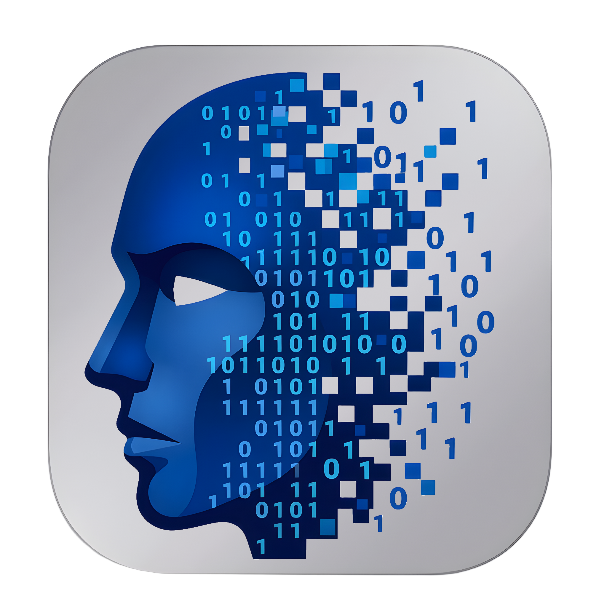

[](LICENSE.md)
[](crates/uia-app/Cargo.toml)
[](https://www.rust-lang.org/)
[](https://svelte.dev/)
[](https://tauri.app/)

<div align="center">
  
</div>

# U.I.A. - User Interface Agent

UIA is a voice-first desktop assistant (Svelte + Tauri UI over a Rust
backend) that talks to a realtime speech engine — OpenAI Realtime by
default, Amazon Bedrock Nova Sonic 2 as a manually-selected fallback, with
Azure AI Foundry also wired up — and can call out to MCP tools mid-conversation.

## Getting started

```bash
pnpm install
cp uia.example.toml uia.toml   # edit engine/provider settings
pnpm run tauri dev
```

See [`uia.example.toml`](uia.example.toml) for engine, memory, and audio
configuration, and [`docs/MANUAL-TEST.md`](docs/MANUAL-TEST.md) for the
Windows build prerequisites and manual acceptance checklist.

## Personas

The assistant's identity is a **persona**: a short set of structured fields
rather than a wall of prose. Up to six of them live in `uia-personas.json`
next to `uia.toml`, edited from **Settings → General → Personas…**.

Four fields are required — a name, an archetype (`executive secretary`), how
it speaks, and when to use it — with three optional ones for boundaries, extra
instructions, and a different spoken name. A persona missing any of the four
saves fine but cannot be enabled or made active, so half-written drafts are
never lost to a validation gate and never reach the model either.

The system prompt is **composed** from those fields in a fixed order. There is
deliberately no raw override: composition is what guarantees the brevity and
no-self-introduction rules reach every prompt, and a hand-written prompt is
exactly the thing that drops them.

Each persona can carry its own avatar, shown in the HUD and beside its name in
Settings. Still images are downscaled on import; animated GIF and WebP are kept
as they are so they keep animating.

### Letting the assistant switch

With **"Let the assistant suggest switching persona"** on, and at least two
personas enabled, the assistant is given a `switch_persona` tool. It is told to
ask first and to say so afterwards — a prompt-level rule, and therefore a strong
instruction rather than a guarantee. If it ever switches unasked, say "switch
back".

A switch **rotates** the session: it disconnects, reconnects with the new
prompt, and replays the conversation, which measures at a median of ~840 ms on
OpenAI. Not a live `session.update`, because Nova has no live-swap path and a
design needing rotation anyway would otherwise have two divergent routes
through identity. The session is not listening for that moment, so anything
said during it is lost rather than queued.

A voice switch lasts for the life of the process. Restarting returns to
whichever persona Settings marks active.

## MCP tools

UIA can give the assistant tools from MCP servers, added from the app's
**Settings → MCP** tab rather than hand-edited config. Two transports are
supported, and only two:

- **Local — `.mcpb` bundle.** A zip containing a validated
  `manifest.json` that declares the command to launch. Runs as a
  subprocess over stdio. Desktop only: iOS forbids spawning subprocesses
  and Android heavily restricts it, so a `.mcpb` local server is
  unavailable on mobile builds. The bundle must be self-contained: the
  command it launches has to be an executable shipped inside the zip, so
  a bare `server.py` or `npx -y some-server@latest` is refused. Package
  the server into a single executable first (`bun build --compile`,
  `deno compile`, PyInstaller), or vendor its interpreter alongside the
  source — see [`docs/MCP.md`](docs/MCP.md#what-the-rule-actually-enforces-self-contained-not-compiled).
- **Remote — HTTP(S) server.** Must answer the MCP `initialize` handshake
  and declare its tools live before it can be saved; there is no way to
  register a server "blind." This is also the only transport available on
  mobile. A newly added remote server starts disabled; enabling it is the
  whole trust decision.

There is no other way to add a tool server: no bare command string, no
unvalidated URL. What's approved is recorded in `uia-mcp.json` next to
`uia.toml`.

Full details — the manifest schema, the security reasoning, and the
handshake/validation flow — are in [`docs/MCP.md`](docs/MCP.md).

## Contributing and security

Pull requests are welcome. Read [CONTRIBUTING.md](CONTRIBUTING.md) first —
contributions require accepting the [CLA](CLA.md), under which you keep the
copyright in what you write. Participation is covered by the
[Code of Conduct](CODE_OF_CONDUCT.md).

Found a security vulnerability? Report it privately through GitHub Security
Advisories rather than opening an issue. [SECURITY.md](SECURITY.md) has the
process and what's in scope.

## License

UIA is **source-available, not open source**. Pick whichever of these two
standard licenses describes you — see [LICENSE.md](LICENSE.md):

- [PolyForm Noncommercial 1.0.0](LICENSES/PolyForm-Noncommercial-1.0.0.md) — if
  you are an individual using UIA for personal study, hobby projects, or private
  entertainment.
- [PolyForm Internal Use 1.0.0](LICENSES/PolyForm-Internal-Use-1.0.0.md) — if you
  are an organization using UIA for your own internal business operations.

Running and modifying UIA for yourself is fine under either. Neither lets you
put UIA, or anything built from it, into a product or service you provide to
someone else — no selling it, hosting it, embedding it, or handing it to your
own customers. LICENSE.md adds one narrow grant on top: you may fork this
repository to open a pull request against it.

Three things sit outside those licenses:

- **Branding.** The MycorX and U.I.A. names, logos, and icons are covered by
  [TRADEMARKS.md](TRADEMARKS.md). A fork does not carry a right to use them.
- **Dependencies.** Every third-party crate and npm package UIA builds on keeps
  its own license; they are listed in [NOTICE.txt](NOTICE.txt).
- **Contributions.** Contributors keep their own copyright and grant MycorX a
  license to use the work — see [CLA.md](CLA.md) and
  [CONTRIBUTING.md](CONTRIBUTING.md).

Copyright © 2026 MycorX (Daniel, Sole Trader). All rights reserved.
